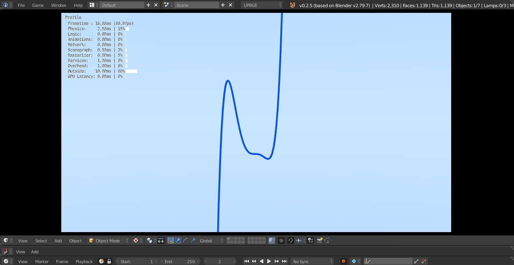

# 3D-Math-Plotter
Math Plotter for Functions in a 3D Space and Viewport

Draw Math Functions on Screen

for Linear Algebra and Analytical Geometry or Calculus study

all commons functions are available to draw on my plotter

A cross platform App project named Tenaz Math Plotter, 

for mobile App the link is here: https://play.google.com/store/apps/details?id=com.zigasistemas.tenazplotter

Used tech: Python3, Blender, UPBGE, accelerated by OpenGL

visit my website too: http://josielsoares.com
